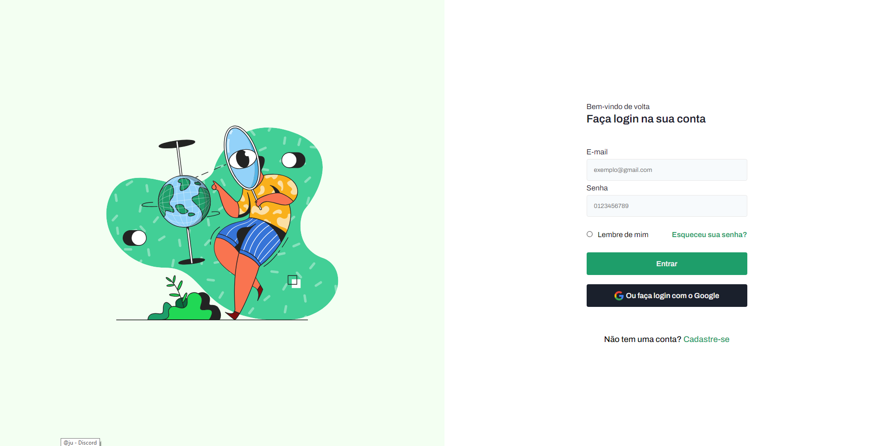

# Pagina de Login

## Descrição
Este projeto é uma aplicação web desenvolvida para oferecer uma solução para uma pagina de login. Com uma interface intuitiva e amigável, A página é projetada para ser minimalista e fácil de entender, servindo como uma base sólida para implementações mais complexas.

## Demonstração

## Instalação
1. Clone este repositório: `git clone https://github.com/EltonKasesky/Pagina-Login.git`
- Abra o arquivo `index.html` no seu navegador.

2. Abra o link abaixo, e veja o site hospedado na Vercel
- Link: [`Pagina Login Vercel`](https://pagina-login-kasesky.vercel.app)

## Funcionalidades
1. Responvidade
- Está aplicação web foi desenvolvida com arquitetura responsiva.

2. UI/UX Figma
- Foi utilizado a ferramenta figma para desenvolver o design deste site

3. Tecnologias utilizadas
- HTML
- CSS

## Contribuindo
Contribuições são bem-vindas! Abra uma issue ou envie um pull request para sugerir melhorias, correções de bugs etc.

## Autor
- [Elton Giglio Kasesky](https://github.com/EltonKasesky)